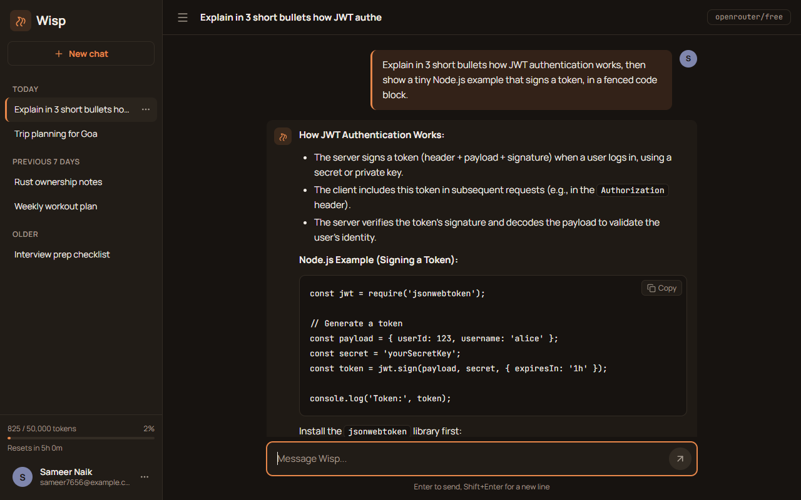
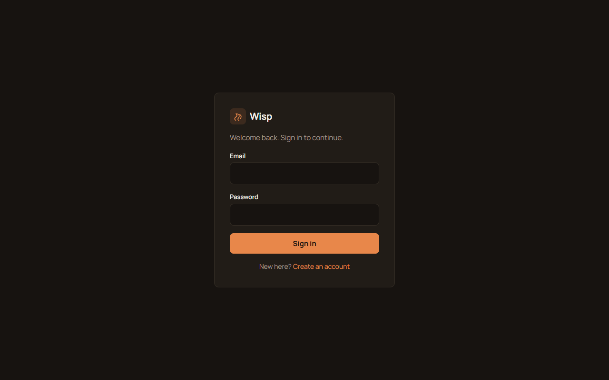
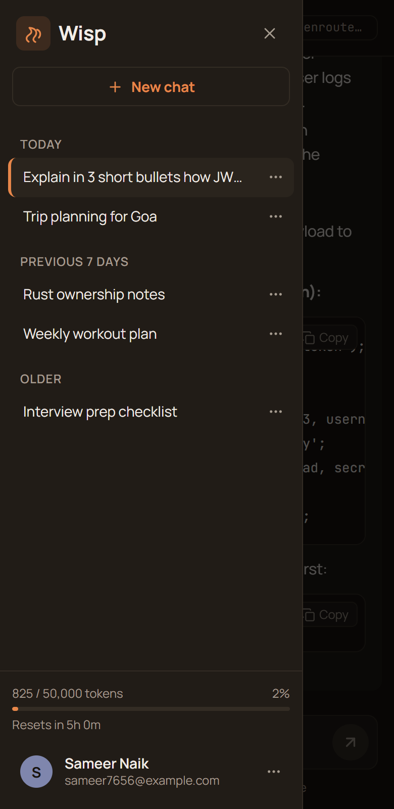
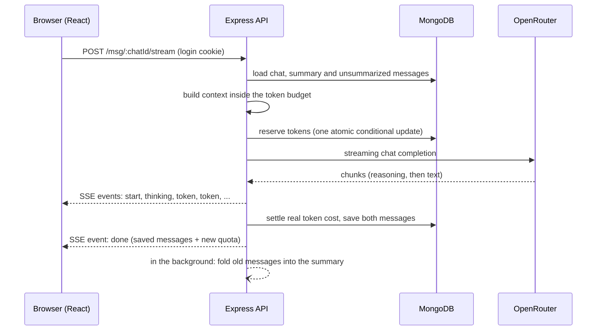

# Wisp

A chat app with streaming AI replies, built to show real backend engineering rather than just calling an API.
Node.js + Express + MongoDB on the server, React on the client, free models through [OpenRouter](https://openrouter.ai).



<p>
  
  
</p>

## What makes it more than a wrapper

| Concept | What Wisp does | Where |
|---|---|---|
| **Stateless LLM, stateful chat** | An LLM remembers nothing between requests, so every request rebuilds the conversation inside a token budget (system prompt + summary + newest messages that fit). | [service/contextBuilder.js](service/contextBuilder.js) |
| **Race-safe token quota** | Reserve an estimate with one atomic conditional update, then settle to the real cost or refund on failure. Ten parallel requests can never overshoot the limit (there is a test for exactly this). | [service/quotaService.js](service/quotaService.js) |
| **Rolling summary memory** | When a chat gets long, old messages are folded into a short summary in the background. A stale summary is rejected with optimistic concurrency. | [service/summaryService.js](service/summaryService.js) |
| **Streaming with Server-Sent Events** | Tokens reach the browser while the AI is still writing. Handles backpressure, heartbeats, a "thinking" phase, and the Stop button (closing the connection aborts the AI call, the partial reply is saved and charged by estimate). | [controllers/messageController.js](controllers/messageController.js), [client/src/utils/sse.js](client/src/utils/sse.js) |
| **Resilience** | A failed or empty AI reply is retried once on the router model; a failed request refunds its reserved tokens; a new chat is only created after the AI answered. | [service/openRouter.js](service/openRouter.js) |
| **Security basics** | bcrypt, JWT in an httpOnly SameSite cookie, Zod validation, model whitelist (the API key is shared), helmet, body size limit, rate limit that counts only failed logins. | [middlewares/](middlewares), [validators/](validators) |

## How one message flows



If the browser closes the connection (Stop button or closed tab) the server aborts the OpenRouter request,
saves the partial reply marked as interrupted, and settles the quota with an estimate.

## Tech stack

- **Server:** Node.js (ESM), Express 5, Mongoose 9, Zod 4, bcrypt, jsonwebtoken, helmet, express-rate-limit
- **AI:** OpenRouter SDK, default model `openrouter/free` (a router over free models, no paid API needed)
- **Client:** React 19, Vite, React Router, react-markdown, Lucide icons, Manrope + JetBrains Mono (self-hosted fonts)
- **Tests:** Node's built-in test runner (`node --test`), no extra test framework

## Getting started

You need Node.js 20.19 or newer, a MongoDB server (local or Atlas) and a free OpenRouter API key from <https://openrouter.ai/keys>.

```bash
git clone https://github.com/sam-15295/Wisp.git
cd Wisp
npm install
npm --prefix client install

cp .env.example .env        # on Windows: copy .env.example .env
# edit .env: set MONGO_URL, JWT_SECRET and OPENROUTER_API_KEY
```

Run the two servers in two terminals:

```bash
npm run dev       # API on http://localhost:3000
npm run client    # React app on http://localhost:5173  (open this one)
```

The Vite dev server proxies `/user`, `/chat` and `/msg` to the API, so the browser only ever talks to one origin.
That keeps the httpOnly login cookie working and means no CORS setup is needed.

### Configuration

Everything is in `.env` (see [.env.example](.env.example) for the full list with comments).

| Variable | Default | Meaning |
|---|---|---|
| `OPENROUTER_API_KEY` | required | Free key from OpenRouter |
| `DEFAULT_AI_MODEL` | `openrouter/free` | Model used for new chats and as the retry fallback |
| `ALLOWED_MODELS` | default model only | Comma separated list users may pick from (server side whitelist) |
| `TOKEN_LIMIT` / `TOKEN_WINDOW_HOURS` | `10000` / `5` | Token budget per user and how long one window lasts |
| `MAX_CONTEXT_TOKENS` / `MAX_REPLY_TOKENS` | `3000` / `1500` | History sent to the AI and cap on one reply |
| `SUMMARY_TRIGGER` / `SUMMARY_KEEP_RECENT` | `16` / `6` | When to fold old messages and how many recent ones stay verbatim |
| `AUTH_RATE_LIMIT` / `AUTH_RATE_WINDOW_MINUTES` | `10` / `15` | Failed login or signup attempts allowed per IP |

> Free reasoning models can spend a thousand tokens thinking before a short answer, and those tokens count.
> If the usage bar fills up quickly while trying the app, raise `TOKEN_LIMIT`.

## API

All routes except signup and login need the login cookie.

| Method | Route | Purpose |
|---|---|---|
| POST | `/user/signup`, `/user/login`, `/user/logout` | Account and session |
| GET | `/user/profile` | Profile and current token usage |
| DELETE | `/user/delete` | Delete account with all chats and messages |
| GET | `/chat/models` | Models the user may choose |
| GET | `/chat/getRecentChat` | Latest 50 chats |
| POST | `/chat/createChat` | Create an empty chat with a chosen model |
| GET / PATCH / DELETE | `/chat/:chatId` | Read, rename, delete one chat |
| GET | `/msg/:chatId` | All messages of a chat |
| POST | `/msg`, `/msg/:chatId` | Send a message, wait for the whole reply (JSON) |
| POST | `/msg/stream`, `/msg/:chatId/stream` | Send a message and stream the reply (SSE) |

The stream sends these events (`event: name` + `data: JSON`), plus `: ping` comment lines as heartbeat:

| Event | When |
|---|---|
| `start` | Request accepted, tokens reserved |
| `thinking` | The model started reasoning, no text yet |
| `token` | A piece of the reply: `{ text }` |
| `done` | Finished: saved messages, chat id, usage and the updated quota |
| `error` | Failed after the stream started (before that, errors are normal JSON with a status code) |

## Tests

```bash
npm test
```

Covers the context builder, summary helpers, model whitelist, validators, the SSE parser and the client helpers.
The quota tests run against a real MongoDB (database `chatgpt_quota_test`) because their point is database atomicity;
they are skipped automatically if MongoDB is not running.

## Project structure

```
config/        database and OpenRouter connections, model whitelist
model/         Mongoose schemas: user (with token usage), chat (with summary), message
validators/    Zod schemas for signup and login
middlewares/   auth (JWT cookie), chatId check, rate limiter
routes/        one router per resource
controllers/   HTTP layer: user, chat, message (send + stream)
service/       the logic: contextBuilder, quotaService, summaryService, chatService, openRouter
test/          server tests
client/        React app (Vite): auth screens, sidebar, streaming chat window
docs/          screenshots used in this README
```

## Design decisions and known limits

- **Token counts are estimated for budgeting** (about 4 characters per token) and **exact for accounting** (the provider reports usage). A stopped reply has no provider numbers, so it is charged by estimate.
- **The reservation is worst case** (prompt + maximum reply), so a user close to the limit can be refused even if the real reply would have fit. The unused part is refunded right after.
- **The free router picks a random free model per request.** Quality and latency vary, and it can occasionally route to an unusual model. Set `DEFAULT_AI_MODEL` to one specific model for consistent answers; specific free models are sometimes overloaded, which is why a failed request falls back to the router.
- **The summary lock and the rate limiter live in memory**, which is right for one server instance. With several instances they would move to Redis or a database lock (the summary write is already safe through optimistic concurrency).
- **No database transactions**: standalone MongoDB does not support them. The order of operations (reserve, call the AI, settle, then save) keeps a failure from leaving a half finished turn.
- **Logins last one hour** and there is no refresh token. The cookie is httpOnly and SameSite=Lax, and `secure` is switched on when `NODE_ENV=production` (needs HTTPS).

## Production build

`npm run client:build` creates `client/dist`. Serve it from any static host behind a reverse proxy that forwards
`/user`, `/chat` and `/msg` to the API on the same origin, and set `NODE_ENV=production`.

## License

ISC
